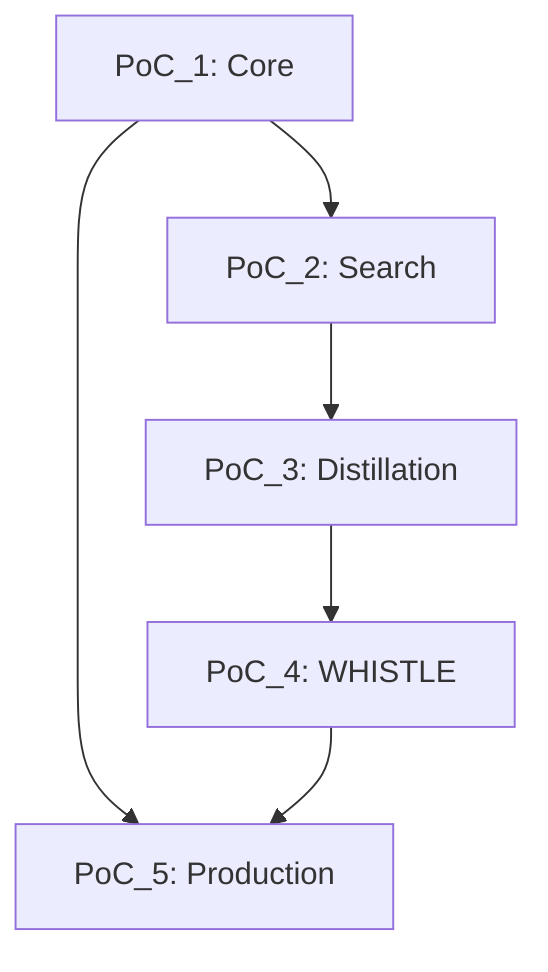

# PROJECT ROUTE: Gineers-KG4EPIC Knowledge System

## PROJECT Metadata

```yaml
project_id: "PROJECT_GINEERS_KG4EPIC"
project_name: "Gineers-KG4EPIC Knowledge Graph System"
vision: "EPIC-TIDE powered knowledge execution and learning system"
created_by: "Terminal-1-architect"
created_at: "2025-01-25"
methodology: "EPIC-TIDE"
```

## PROJECT Vision

```yaml
mission: |
  Build a knowledge system that captures HOW TO BUILD WHAT,
  sequences knowledge into achievable paths,
  and preserves learning from every attempt.

core_principles:
  - "Every action is a CONTRACT"
  - "Every goal is a ROUTE"
  - "Every attempt is a TIDE with learning"
  - "Evidence drives progress, not time"
```

## PROJECT Hierarchy

```
PROJECT (Gineers-KG4EPIC)
├── PoC_1: Core Implementation [CURRENT]
│   └── ROUTE_001_EPIC_TIDE_CORE
│       ├── CONTRACT_001_DOCKER_SETUP
│       ├── CONTRACT_002_DATABASE_SCHEMA
│       ├── CONTRACT_003_API_STRUCTURE
│       ├── CONTRACT_004_CONTRACT_CRUD
│       ├── CONTRACT_005_ROUTE_CRUD
│       ├── CONTRACT_006_TIDE_EXECUTION
│       ├── CONTRACT_007_TEST_EXECUTION
│       └── CONTRACT_008_LEARNING_EXTRACTION
│
├── PoC_2: Semantic Intelligence [FUTURE]
│   └── ROUTE_002_SEMANTIC_SEARCH
│       ├── CONTRACT_021_EMBEDDING_SETUP
│       ├── CONTRACT_022_E5_INTEGRATION
│       ├── CONTRACT_023_VECTOR_STORAGE
│       ├── CONTRACT_024_SIMILARITY_SEARCH
│       ├── CONTRACT_025_SEARCH_API
│       └── CONTRACT_026_SEARCH_VALIDATION
│
├── PoC_3: Knowledge Distillation [FUTURE]
│   └── ROUTE_003_DISTILLATION
│       ├── CONTRACT_031_PATTERN_DETECTION
│       ├── CONTRACT_032_DISTILLED_CONTRACT
│       ├── CONTRACT_033_DISTILLED_ROUTE
│       ├── CONTRACT_034_PATTERN_STORAGE
│       └── CONTRACT_035_REUSE_VALIDATION
│
├── PoC_4: WHISTLE Orchestration [FUTURE]
│   └── ROUTE_004_WHISTLE
│       ├── CONTRACT_041_WHISTLE_SCHEMA
│       ├── CONTRACT_042_COMMAND_PARSER
│       ├── CONTRACT_043_ORCHESTRATION_ENGINE
│       └── CONTRACT_044_EXECUTION_SPEED_TEST
│
└── PoC_5: Production Deployment [FUTURE]
    └── ROUTE_005_PRODUCTION
        ├── CONTRACT_051_KUBERNETES_SETUP
        ├── CONTRACT_052_MONITORING
        ├── CONTRACT_053_BACKUP_RECOVERY
        ├── CONTRACT_054_API_DOCUMENTATION
        ├── CONTRACT_055_SECURITY_AUDIT
        ├── CONTRACT_056_LOAD_TESTING
        └── CONTRACT_057_PRODUCTION_RELEASE
```

## PoC Progression (ROUTEs)

### PoC_1: EPIC-TIDE Core ✅ [Current]
```yaml
route: "ROUTE_GINEERS_KG_POC1_001"
goal: "Prove CONTRACT + ROUTE + TIDE concepts work"
contracts: 8
evidence_required:
  - "Three core tables operational"
  - "CRUD APIs functional"
  - "TIDE execution tracking"
  - "Learning extraction demonstrated"
status: "planning"
```

### PoC_2: Semantic Intelligence
```yaml
route: "ROUTE_GINEERS_KG_POC2_001"
goal: "Add semantic search with embeddings"
contracts: ~6
evidence_required:
  - "E5 embeddings generated"
  - "Similarity search working"
  - "Pattern discovery enabled"
status: "not_started"
depends_on: "PoC_1 proven"
```

### PoC_3: Knowledge Distillation
```yaml
route: "ROUTE_GINEERS_KG_POC3_001"
goal: "Extract patterns from multiple projects"
contracts: ~5
evidence_required:
  - "DISTILLED-CONTRACT created"
  - "Pattern recognition across projects"
  - "Reusability demonstrated"
status: "not_started"
depends_on: "Multiple projects completed"
```

### PoC_4: WHISTLE Orchestration
```yaml
route: "ROUTE_GINEERS_KG_POC4_001"
goal: "Rapid execution through WHISTLEs"
contracts: ~4
evidence_required:
  - "WHISTLE commands working"
  - "Orchestration of patterns"
  - "10x speed improvement"
status: "not_started"
depends_on: "Patterns identified"
```

### PoC_5: Production Readiness
```yaml
route: "ROUTE_GINEERS_KG_POC5_001"
goal: "Production deployment with monitoring"
contracts: ~7
evidence_required:
  - "Kubernetes deployment"
  - "Monitoring and alerting"
  - "Backup and recovery"
  - "API documentation"
status: "not_started"
depends_on: "Core features complete"
```

## ROUTE Dependencies



## Evidence Gates Between PoCs

```yaml
GATE_POC1_TO_POC2:
  evidence_required:
    - "CONTRACT CRUD proven"
    - "ROUTE sequencing works"
    - "TIDE history preserved"
  unlocks: "Semantic capabilities"

GATE_POC2_TO_POC3:
  evidence_required:
    - "3+ projects completed"
    - "Similar patterns identified"
    - "Search accuracy > 80%"
  unlocks: "Pattern extraction"

GATE_POC3_TO_POC4:
  evidence_required:
    - "10+ DISTILLED-CONTRACTs"
    - "Reusability proven"
  unlocks: "Orchestration layer"

GATE_TO_PRODUCTION:
  evidence_required:
    - "All core features working"
    - "Performance benchmarks met"
    - "Security audit passed"
  unlocks: "Production deployment"
```

## Success Metrics

```yaml
technical_metrics:
  - "API response time < 100ms"
  - "Search accuracy > 80%"
  - "99.9% uptime"
  - "Zero data loss"

business_metrics:
  - "Knowledge reuse > 50%"
  - "Development speed 3x faster"
  - "Learning capture 100%"
  - "Pattern discovery automated"
```

## Risk Management

```yaml
strategic_risks:
  - risk: "EPIC-TIDE concept too complex"
    mitigation: "Start with minimal PoC_1"
    evidence: "User can explain CONTRACT vs ROUTE vs TIDE"
    
  - risk: "Performance at scale"
    mitigation: "Two-tier embedding strategy"
    evidence: "Cost reduced by 99.5%"
    
  - risk: "Adoption resistance"
    mitigation: "Clear value demonstration in PoC_1"
    evidence: "Learning preservation saves time"
```

## Technology Stack

```yaml
core:
  - "PostgreSQL 15 with pgvector"
  - "Node.js 18 + TypeScript"
  - "Docker + Docker Compose"
  - "Express.js REST API"

future:
  - "E5-large-v2 embeddings"
  - "Redis caching"
  - "Kubernetes orchestration"
  - "Grafana monitoring"
```

## PROJECT Execution Strategy

```yaml
phase_1_foundation:
  duration: "Evidence-driven, not time-based"
  focus: "PoC_1 - Core concepts"
  outcome: "EPIC-TIDE proven"

phase_2_intelligence:
  trigger: "PoC_1 proven"
  focus: "PoC_2 - Semantic search"
  outcome: "Pattern discovery enabled"

phase_3_scale:
  trigger: "Patterns identified"
  focus: "PoC_3 + PoC_4"
  outcome: "Rapid knowledge execution"

phase_4_production:
  trigger: "Core features complete"
  focus: "PoC_5 - Deployment"
  outcome: "Production system"
```

## Current Status

```yaml
active_route: "ROUTE_GINEERS_KG_POC1_001"
current_contract: "Planning phase"
completed_contracts: 0
total_contracts: 8
current_tide: "Not started"

next_action: "Execute CONTRACT_001_DOCKER_SETUP"
```

## Learning Repository

```yaml
learnings_location: "Docs/Gineers-KG/TIDES/"
pattern_location: "Docs/Gineers-KG/PATTERNS/"
distilled_location: "Docs/Gineers-KG/DISTILLED/"
```

---

*PROJECT Status: Active*
*Methodology: EPIC-TIDE*
*Current PoC: PoC_1 - Core Implementation*