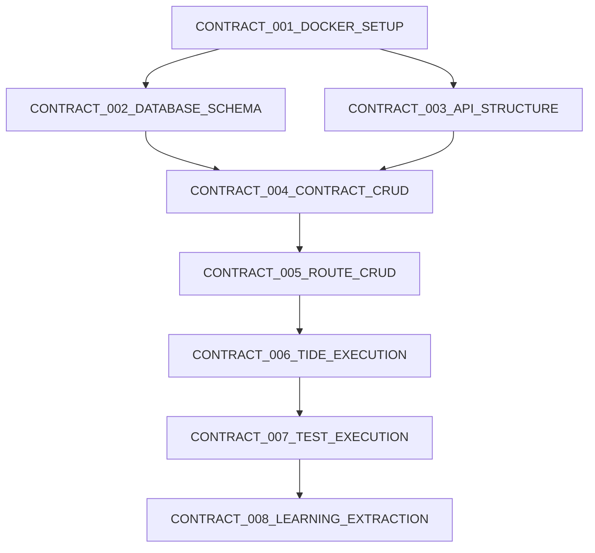

# ROUTE: EPIC-TIDE Core Implementation

## ROUTE Metadata

```yaml
route_id: "ROUTE_GINEERS_KG_POC1_001"
route_name: "EPIC-TIDE Core for Gineers-KG4EPIC"
goal: "Functional CONTRACT + ROUTE + TIDE system with learning preservation"
route_type: "poc"
created_by: "Terminal-1-architect"
created_at: "2025-01-25"
parent_poc: "POC_1_EPIC_TIDE_CORE"
```

## Goal Definition

```yaml
goal_statement: |
  Implement minimal viable EPIC-TIDE system proving:
  - CONTRACTs can be created and executed
  - ROUTEs sequence CONTRACTs to achieve goals
  - TIDEs track execution attempts with learning
  
business_value: |
  Foundation for knowledge-driven development where:
  - Every action is documented and reusable
  - Failures become learning opportunities
  - Progress is evidence-based, not time-based
  
technical_value: |
  Proves the three-table architecture works:
  - contracts table for atomic units
  - routes table for sequencing
  - tides table for execution history
```

## CONTRACT Sequence

```yaml
contract_sequence:
  # Stage 1: Infrastructure
  - CONTRACT_001_DOCKER_SETUP
  - CONTRACT_002_DATABASE_SCHEMA
  
  # Stage 2: Core Implementation
  - CONTRACT_003_API_STRUCTURE
  - CONTRACT_004_CONTRACT_CRUD
  - CONTRACT_005_ROUTE_CRUD
  - CONTRACT_006_TIDE_EXECUTION
  
  # Stage 3: Validation
  - CONTRACT_007_TEST_EXECUTION
  - CONTRACT_008_LEARNING_EXTRACTION
```

## Execution Flow



## Evidence Gates

```yaml
GATE_1_INFRASTRUCTURE:
  after_contracts: [CONTRACT_001_DOCKER_SETUP, CONTRACT_002_DATABASE_SCHEMA]
  required_evidence:
    - "Docker containers running"
    - "Database tables created"
    - "API server responding"
  unlocks: "Core implementation can begin"

GATE_2_APIS:
  after_contracts: [CONTRACT_004_CONTRACT_CRUD, CONTRACT_005_ROUTE_CRUD]
  required_evidence:
    - "CONTRACT created via API"
    - "ROUTE created with CONTRACT sequence"
    - "All CRUD operations functional"
  unlocks: "TIDE execution implementation"

GATE_3_EXECUTION:
  after_contracts: [CONTRACT_006_TIDE_EXECUTION, CONTRACT_007_TEST_EXECUTION]
  required_evidence:
    - "TIDE_1 shows partial completion"
    - "TIDE_2 shows full success"
    - "Learning extracted from failures"
  unlocks: "PoC completion"

GATE_FINAL:
  after_contracts: [CONTRACT_008_LEARNING_EXTRACTION]
  required_evidence:
    - "Complete ROUTE executed through TIDEs"
    - "Learning preservation demonstrated"
    - "All core concepts proven"
  unlocks: "ROUTE PROVEN - PoC_1 COMPLETE"
```

## TIDE Tracking

```yaml
expected_tides: 1-2
typical_issues:
  - "TIDE_1: Database connection issues"
  - "TIDE_1: API endpoint typos"
  - "TIDE_2: Fix issues found in TIDE_1"
  
learning_opportunities:
  - "Docker networking setup patterns"
  - "PostgreSQL schema best practices"
  - "TypeScript API structure patterns"
```

## Success Criteria

```yaml
must_have:
  - "Three tables (contracts, routes, tides) operational"
  - "Full CRUD for all three entities"
  - "TIDE execution tracking with outcomes"
  - "Learning extraction from failed TIDEs"
  - "Evidence-driven progression (no time planning)"

nice_to_have:
  - "API response time < 100ms"
  - "Docker image size < 200MB"
  - "Automated tests for all endpoints"
```

## Risk Management

```yaml
risks:
  - risk: "Docker networking complexity"
    likelihood: "medium"
    impact: "high"
    mitigation: "Use docker-compose for simplified networking"
    
  - risk: "Schema changes during development"
    likelihood: "high"
    impact: "medium"
    mitigation: "Use migrations, not direct SQL"
    
  - risk: "Confusing CONTRACT vs ROUTE vs TIDE"
    likelihood: "medium"
    impact: "high"
    mitigation: "Clear examples in test execution"
```

## Dependencies

```yaml
external_dependencies:
  - "Docker Desktop or Docker Engine"
  - "Node.js 18+"
  - "PostgreSQL 15+"
  - "TypeScript 5+"

knowledge_dependencies:
  - "Understanding of EPIC-TIDE concepts"
  - "Basic Docker knowledge"
  - "REST API design principles"
  - "PostgreSQL and SQL"
```

## Parallel Execution Opportunities

```yaml
parallel_groups:
  - group_1: [CONTRACT_002_DATABASE_SCHEMA, CONTRACT_003_API_STRUCTURE]
    reason: "Database and API setup independent"
```

## Next ROUTEs

```yaml
on_success:
  triggers: "ROUTE_POC2_SEMANTIC_SEARCH"
  why: "Add intelligence through embeddings"

on_partial:
  triggers: "ROUTE_POC1_FIXES"
  why: "Complete core before adding features"

on_failure:
  triggers: "ROUTE_POC1_SIMPLIFIED"
  why: "Reduce scope to absolutely minimal"
```

## Test Scenario

```yaml
test_route: "Build Hello World API"
test_contracts:
  - CONTRACT_TEST_1: "Setup Express server"
  - CONTRACT_TEST_2: "Create /hello endpoint"  
  - CONTRACT_TEST_3: "Validate response"

test_tide_1:
  CONTRACT_TEST_1: "✅ Complete"
  CONTRACT_TEST_2: "❌ Failed - typo in route"
  CONTRACT_TEST_3: "⏸️ Blocked"
  learning: "Route was '/helo' not '/hello'"

test_tide_2:
  CONTRACT_TEST_1: "✅ Reused"
  CONTRACT_TEST_2: "✅ Fixed typo"
  CONTRACT_TEST_3: "✅ Complete"
  outcome: "ROUTE PROVEN"
```

---

*ROUTE Status: planning*
*Current TIDE: Not started*
*Progress: 0/8 CONTRACTs completed*