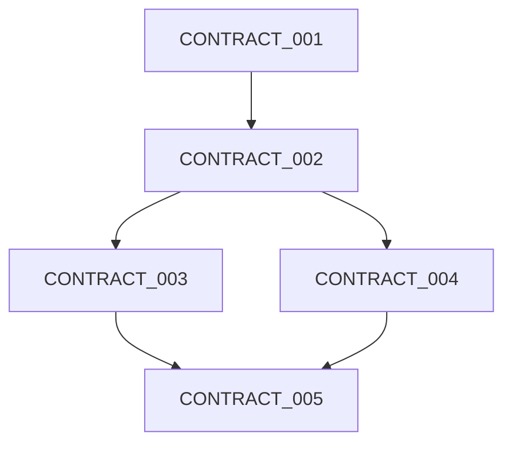

# ROUTE: [ROUTE_NAME]

## ROUTE Metadata

```yaml
route_id: "ROUTE_[PROJECT]_[GOAL]_[VERSION]"
route_name: "[Human-readable route name]"
goal: "[What this ROUTE achieves when proven]"
route_type: "[poc|feature|fix|optimization]"
created_by: "[Terminal-X-role]"
created_at: "[YYYY-MM-DD]"
parent_poc: "[POC_ID if applicable]"
```

## Goal Definition

```yaml
goal_statement: |
  [Clear description of what success looks like]
  
business_value: |
  [Why this ROUTE matters to stakeholders]
  
technical_value: |
  [What technical capability this proves]
```

## CONTRACT Sequence

```yaml
contract_sequence:
  # Stage 1: [Stage Name]
  - CONTRACT_001_[NAME]
  - CONTRACT_002_[NAME]
  
  # Stage 2: [Stage Name]  
  - CONTRACT_003_[NAME]
  - CONTRACT_004_[NAME]
  
  # Stage 3: [Stage Name]
  - CONTRACT_005_[NAME]
```

## Execution Flow



## Evidence Gates

```yaml
GATE_1_[NAME]:
  after_contracts: [CONTRACT_001, CONTRACT_002]
  required_evidence:
    - "[Evidence 1]"
    - "[Evidence 2]"
  unlocks: "[What this gate enables]"

GATE_2_[NAME]:
  after_contracts: [CONTRACT_003, CONTRACT_004]
  required_evidence:
    - "[Evidence 3]"
    - "[Evidence 4]"
  unlocks: "[What this gate enables]"

GATE_FINAL:
  after_contracts: [CONTRACT_005]
  required_evidence:
    - "[Final evidence]"
  unlocks: "ROUTE PROVEN"
```

## TIDE Tracking

```yaml
expected_tides: 1-3
typical_issues:
  - "[Common issue in TIDE_1]"
  - "[Common issue that needs TIDE_2]"
  
learning_opportunities:
  - "[What we expect to learn]"
  - "[Patterns to discover]"
```

## Success Criteria

```yaml
must_have:
  - "[Critical success factor 1]"
  - "[Critical success factor 2]"
  - "[Critical success factor 3]"

nice_to_have:
  - "[Bonus achievement 1]"
  - "[Bonus achievement 2]"
```

## Risk Management

```yaml
risks:
  - risk: "[Potential blocker]"
    likelihood: "[high|medium|low]"
    impact: "[high|medium|low]"
    mitigation: "[How to handle it]"
    
  - risk: "[Another risk]"
    likelihood: "[high|medium|low]"
    impact: "[high|medium|low]"
    mitigation: "[How to handle it]"
```

## Dependencies

```yaml
external_dependencies:
  - "[External system or service]"
  - "[Required tool or library]"

knowledge_dependencies:
  - "[Concept that must be understood]"
  - "[Skill required]"
```

## Parallel Execution Opportunities

```yaml
parallel_groups:
  - group_1: [CONTRACT_002, CONTRACT_003]
  - group_2: [CONTRACT_004, CONTRACT_005]
```

## Next ROUTEs

```yaml
on_success:
  triggers: "ROUTE_[NEXT]"
  why: "[What this enables]"

on_partial:
  triggers: "ROUTE_[ALTERNATIVE]"
  why: "[Alternative path reasoning]"

on_failure:
  triggers: "ROUTE_[RECOVERY]"
  why: "[Recovery strategy]"
```

---

*ROUTE Status: [planning|executing|proven|failed]*
*Current TIDE: [TIDE_N]*
*Progress: [X/Y CONTRACTs completed]*